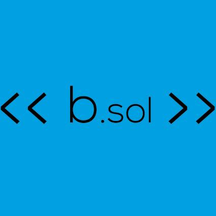

<h1 align="center">

</h1>

<h1 align="center">

</h1>

# Indice

- [Sobre](#-Sobre)
- [Tecnologias utilizadas](#-Tecnologias-utilizadas)
- [Como baixar o projeto](#-Como-baixar-o-projeto)

---

## 🧵 Sobre

O Repositório atual faz parte do curso de capacitação da **byron.solutions** de **Git e Github da Alura**.

---

## 🎮 Tecnologias utilizadas

O curso foi feito usando:

- [Git](https://git-scm.com/)
- [GitHub](https://github.com)
- [VSCode](https://code.visualstudio.com/)

---

## ⬇ Como baixar o projeto

```bash
#Clonar o repositório
$ git clone https://github.com/GuiSalles/Curso-git.git
#Entrar no diretório
$ cd curso-git
#Instalar as dependências
$ yarn install
#Iniciar projeto
$ yarn start
```

--

## 😉 Desenvolvido por **Guilherme Salles**
